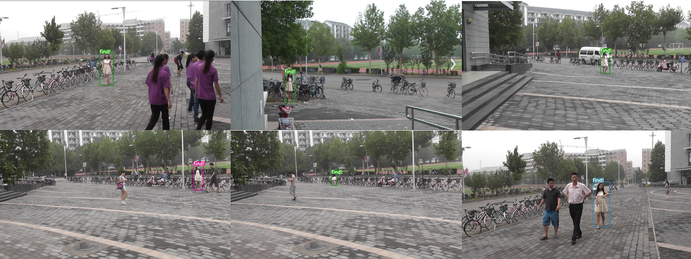

Person search
===============



## Dependencies

Tested under python3.7  MacOS 10.14.6

- python packages
  - opencv-python
  - tb-nightly
  - torch >= 1.0

## Download weights
Download from [here](https://pan.zju.edu.cn/share/6820e9685ffdb4cae86e9f25c0), password:qscx

After download, put the weights into the floder **person_search_demo/weights**

Test
--------

```bash
cd <path to this floder>
python search.py
```

The results will be saved in the output folder

## Train

You can directly use the original [YOLO](https://link.zhihu.com/?Target=https%3A//github.com/ultralytics/yolov3) code for training.

Pedestrian re-identification model is adopted [strong Reid baseline](https://link.zhihu.com/?Target=https%3A//github.com/michuanhaohao/reid-strong-baseline) model.

